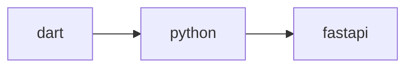

# 开发者文档

## 包一览

| 目录 | 包名 | 语言 | 定位 | 核心模型 |
|------|------|------|------|----------|
| `packages/dart/` | `quanttide_project` | Dart | 数据模型（参考实现） | Project, Task |
| `packages/python/` | `quanttide-project` | Python | 数据模型（Pydantic） | Project, Task |
| `packages/fastapi/` | `fastapi-quanttide-project` | Python | FastAPI CRUD 路由 | ProjectRouter, TaskRouter |
| `packages/flutter/` | `flutter_quanttide_project` | Dart/Flutter | 看板 UI 组件 | BoardView, BoardColumn, BoardCard |

## 概念映射

| 领域概念 | dart | python | fastapi | flutter |
|----------|------|--------|---------|---------|
| 项目 | Project | Project | ProjectRouter | — |
| 任务 | Task | Task | TaskRouter | BoardCard |
| 看板列 | — | — | — | BoardColumn |
| 看板视图 | — | — | — | BoardView |

## 依赖链

```
dart（参考实现，无依赖）
  │
  ├── python（Pydantic 模型，对标 dart）
  │     │
  │     └── fastapi（依赖 python 包）
  │
  └── flutter（UI 组件，依赖 dart 包的概念）
```

`flutter` 包是纯 UI 组件，不包含数据模型，通过外部传入数据渲染。

## 变更一个字段需要在哪些包改

以给 Task 增加一个新字段为例：

| 操作 | dart | python | fastapi | flutter |
|------|------|--------|---------|---------|
| 字段定义 | 改 Task 类 | 改 Task 模型 | 无需改动 | 无需改动 |
| JSON 序列化 | 改 toJson/fromJson | 无需改动（Pydantic 自动） | — | — |
| CRUD 路由 | — | — | 自动继承 | — |
| UI 展示 | — | — | — | 改 BoardCard |

## 维护原则

1. **dart 是参考源** — 新字段先在 dart 包定义，其他语言对照实现
2. **python 包保持纯模型** — 只做 Pydantic 序列化，不做业务逻辑
3. **fastapi 不关心字段** — 从 python 包自动推导 Schema，字段增减无需改 fastapi
4. **flutter 是纯 UI** — 不包含数据模型，通过外部传入数据渲染

## 发布流程



1. dart 包发版（`pub publish`）
2. python 包发版（`uv publish`）
3. fastapi 包发版（`uv publish`，依赖 python 包的最新版本）
4. flutter 包发版（`flutter pub publish`）
